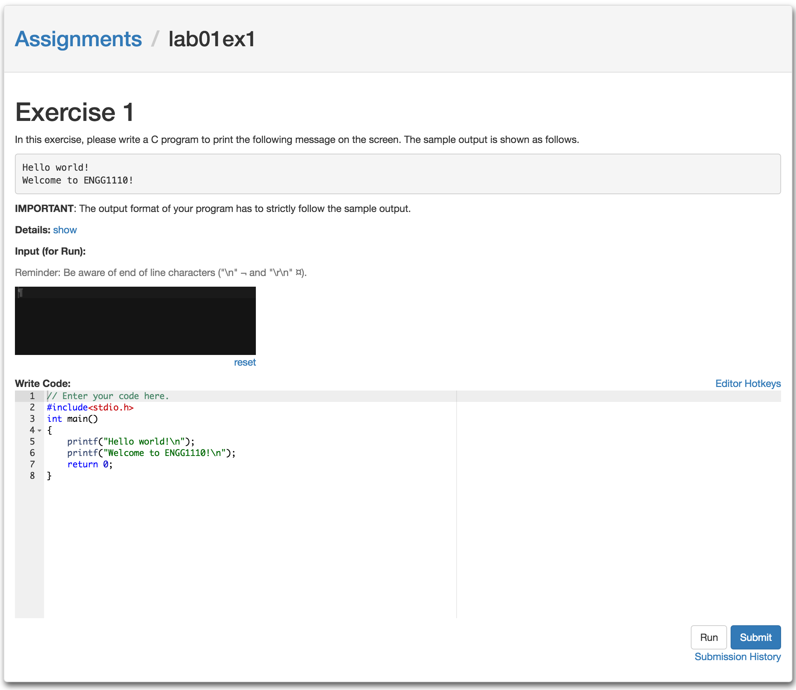

# codeSubmit
> write __Code__ then __Submit__

*codeSubmit* is an online judge for programming assignments. It is initially developed to support the online course taught by [Dr. Wong Tsz Yeung](http://www.cse.cuhk.edu.hk/~tywong/html/index.html) at [CUHK](http://www.cuhk.edu.hk), see the course [here](http://tywong.github.io/gitbook-engg1110/).

Besides this online judge, there is also a platform for students to program game playing AI and compete with each other. See [aimole](https://github.com/leoyuholo/aimole).

## Screenshot

## Deployment
You are recommended to deploy on ubuntu because the prepared scripts are written for environment of ubuntu machines.

On the ubuntu machine, run `shellscripts/npm/installg.sh` to install all the required packages. These includes docker, node.js and npm dependencies of codeSubmit.

codeSubmit persists data on MongoDB and queues jobs on RabbitMQ. To spin them up, you can run `shellscripts/docker/mongodb/mongodb_up.sh` and `shellscripts/docker/rabbitmq/rabbitmq.sh`.

And then, configure codeSubmit by modifying `configs/*Config.coffee`.

To spin up codeSubmit admin for production use, run `shellscripts/docker/production/admin_up.sh`.

To spin up codeSubmit student for production use, run `shellscripts/docker/production/student_up.sh`.

To spin up codeSubmit worker for production use, run `shellscripts/docker/production/worker_up.sh`.

For deploying more instances on multiple machines, run the corresponding [admin, student, worker] script with an extra argument of master ip. E.g. `shellscripts/docker/production/worker_up.sh 192.168.0.101` to spin up a worker with databases connecting to `192.168.0.101`. Same for codeSubmit admin and codeSubmit student.

## Database maintenance
There is only one source to maintain, that is MongoDB.

You can have two ways to backup the database, one is through GUI, another is using crontab to save to AWS S3 regularly.

### GUI
[MongoChef](http://3t.io/mongochef/) is a GUI client of MongoDB. You can use the export feature to backup MongoDB. Next time you want to restore it, you can drop the existing database and then import the one you exported before.

### crontab
Detailed instruction is in [here](./shellscripts/docker/mongodb/instruction.md).

## Development
To spin up all the stuffs for development, run `shellscripts/docker/codesubmit/codesubmit_up.sh`. This will spin up a MongoDB, RabbitMQ, codeSubmit admin, codeSubmit student and codeSubmit worker. And watch for file changes to restart all three codeSubmit instances (admin, student and worker).

To spin up things individually:

Run `shellscripts/docker/mongodb/mongodb_up.sh` for MongoDB.
Run `shellscripts/docker/rabbitmq/rabbitmq.sh` for RabbitMQ. And you can monitor RabbitMQ via visiting http://localhost:15672.

To watch changes and livereload for admin, run `grunt` and visit `http://localhost:8000`
To watch changes and livereload for student, run `grunt student` and visit `http://localhost:8001`
To watch changes and livereload for worker, run `grunt worker`

## Sandbox-run
All the user submitted code are running inside sandbox environment. For each code execution, codeSubmit will spawn docker instances to run the compilation and execution process. This isolates each submission as well as providing security to the host.

This sandbox is a sub-project of Dr. Wong Tsz Yeung's students' final year project. You can find its docker hub repository [here](https://hub.docker.com/r/tomlau10/sandbox-run/).

# LICENSE
This program is free software: you can redistribute it and/or modify
it under the terms of the GNU General Public License as published by
the Free Software Foundation, either version 3 of the License, or
(at your option) any later version.

This program is distributed in the hope that it will be useful,
but WITHOUT ANY WARRANTY; without even the implied warranty of
MERCHANTABILITY or FITNESS FOR A PARTICULAR PURPOSE.  See the
GNU General Public License for more details.

You should have received a copy of the GNU General Public License
along with this program.  If not, see <http://www.gnu.org/licenses/>.
